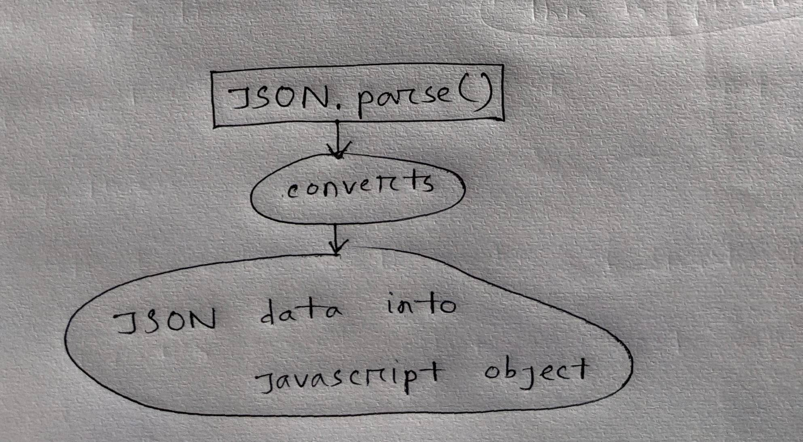
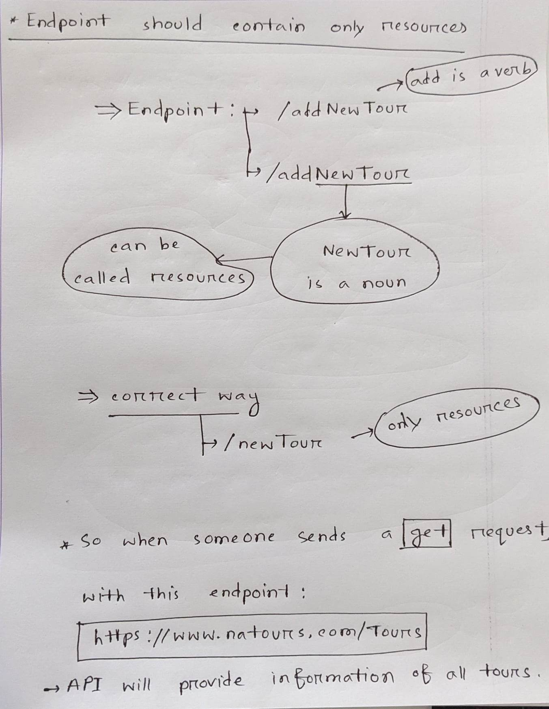

# Node.js-Basic


## List of content


# Intro
===============================================================
* We run javascript code in our browser.
* We need browser inorder to run Javascript.
* I can also run javascript file in the Browser with the help of node.js.

> You must've node.js installed.

<br>
<br>

**How to check the node.js version in terminal?**
```javascript
node -v

//this will output the node.js version. Otherwise it will say node.js is not found.
```


<br>
<br>


**How to run javascript file in the terminal?**
```console
node filename.js
```

> Once you open the javascript file using node, you must need to close it by pressing `ctrl + C`. 

<br>
<br>
<br>


# Modules
===========================================================

**What is Modules?**  <br>
<ins> Answer: </ins> Modules is a `collection` of related `functions/classes` that together provide some kind of service to a program. Node have many modules.

<br>
<br>

## How to use node modules?
* Node modules are included using `require function` in `javascript` files.
```javascript
const fs= require('fs');
```
> It needs to be at the top of the javascript code. `fs` stands for file system.

* This will create an `Object` named `http` which has many built in methods.


<br>
<br>
<br>

## HTTP Module
================================================
* HTTP module allows Node.js to transfer data over the Hyper Text Transfer Protocol (HTTP).
* To include the HTTP module, use the `require()` method at the top of javascript of typescript file.
```javascript
const http = require('http');
```
* The HTTP module can create an HTTP server that listens to server ports and gives a response back to the client.
* `createServer()` method allows node.js to create an `HTTP server` <br>
    ✔️ That server listens to request and <br>
    ✔️ Give feedback according to the request.<br>


<br>
<br>

**What comes after creating a server?** 

✔️ `Listen` to `incoming request` from a `client`.

<br>
<br>

### Create Web Server Using HTTP module
* Two method will be used in this web server creation. <br>
    ✔️ .createServer(a function will be here) <br>
    ✔️ .listen(a port number will be here) <br>
    
those two function will be combined inorder to create a web server that will listen to the HTTP request.
```javascript
var http = require('http');

//create a server object:
http.createServer(function (req, res) {
//here will be some operation related to the request and response according to the request.
}).listen(8080); //the server object listens on port 8080
```

<br>
<br>

**createServer().listen()**
```javascript
//BASIC STRUCTURE OF .listen(); function
createServer().listen(port, localhostaddress, callbackfunction);

// practical use
createServer().listen(8000, "127.0.0.1", ()=>{
    console.log("listening to the port");
    // this call back function is not important
}
```
Where to visit? <br>

<br>
<br>

**localhost & Port** <br>
+++++++++++++++++++++++++++++++++++++++++++++++
<br>

I've played with the `localhost` section. Up above, I wrote `127.0.0.1`

* Now, these values can be different. And the server somehow worked. But `127` has to be exact and the localhost has 4 section seperated by dot(.). It can't be changed.
* But the port can be any `four digit`. You just need to visit the exact port.
* Any changes in the code>> Restart the server in terminal >> revisit the port again.

<br>
<br>


<br>

**How to run node.js files**? <br>
* Run node application in the terminal
* Command `node filename.js`
* go to browser and type `127.0.0.1:8000`


<br>
<br>

* Will be executed when someone tries to access the computer on port 8080 via browser.
* I call it - `send request via HTTP` <br>
* <ins> When a user sends request, it must needs to be end by sending a `response` </ins>
* A request without ending, will keep the request running, A VERY BAD THING.
* `res.end();` ends the response, close the whole server process.
```javascript
var http = require('http');

//create a server object:
http.createServer(function (req, res) {
res.write("Hello world") // this is just a response text which will show a bare text for now.
res.end(); //ends the response, close the whole server process.
}).listen(8080); //the server object listens on port 8080
```
> res.write(), I won't write `res` for now. Just know that res.write(), write some text in the webpage as raw text.

<br>
<br>
<br>

## FILE Module
================================================
```javascript
const fs = require('fs');
```

<br>

**Not important**
* You can work with `node.js` from a `javascript file` and see output in `terminal`.
* File system is one of the core modules of node.js.


<br>
<br>

**File Module**
* With `file module` I can get access  to `read data, write data` from file system.
* An important method of 'fs' is `readFIle` method.
* `readFile` has two variation. 
  - Syncronous(doesn't block the process)
  - Asyncronous(Blocks the process)
  
```javascript
const fs= require("fs");


//Syncronous
//this readfile doesn't block the processing.
const textReadFromFile=fs.readFileSync("./txt/file.txt", "utf-8);
console.log(textReadFromFile);


//Asyncronous
//this readFile blocks the singleThread Processing
fs.readFile("./txt/file.txt", "utf-8", (err,data){
//data argument gets all the text from file and store it in 'data' argument.
console.log(data);
})


// BASIC STRUCTURE
let x = fs.readFileSync([filepath], [encoding option]);

fs.readFile([filepath], [encoding option], [callback function]); 
// the callback function gets data and works with it.
```

<br>
<br>

**Complex code example**
```javascript
fs.readFile("./txt/start.txt", "utf-8", (err,data)=>{
    if(err){
        console.log("Error");
        return;
        //if error argument is true then console "Error" function and close the process
    }
    console.log(data);
    fs.readFile("./txt/data.txt", "utf-8", (err2,data2)=>{
        //err,data sequence can't be different
        // first argument returns == error 
        // second arguemnt returns == data that got from .txt file
        
        if(err2){
            console.log("Error came from second callback")
        }
        
        //if there is no error, show both data
        console.log(`${data} and ${data2};
        fs.readFile("./txt/dataTwo.txt", "utf-8", (err3,data)=>{
           if(err3){
            console.log("Error came from second callback")
            }
            
            console.log(`${data} and ${data2} and ${data3}`);
        }
    }
}
```
<br>

A typical node project looks/structured like this and people call this `callback hell`.
> I'll see this type of node pattern all over the node project.

<br>
<br>
<br>
<br>


# request URL(request.url)
==================================================== 

* `req.url` let us `use/read` the requested `url` from the browser.
* Code:
```javascript
let http= require("http");
let url= require("url");

const server = http.createServer((req,res)=>{
    //this gets the url that is requested by a user
    const pathName= req.url;
    
    //showing the pathname in the console
    console.log(pathname);
    
    //ending the response by rendering some text
    res.end("hello from server");
});
```


<br>
<br>

### What is Routing?
A `protocol` used for identifying `network paths`.

<br>
<br>

**Routing in NODE.JS** 

* Routing defines the way in which the client request are handled by application endpoint.
* Application EndPoint: When a user sends request, that device is called endpoint. For example: Laptop and Desktop, Phone.

<br>
<br>
<br>


# Routing in Node.js(oversimplified concept)
>Quote: `path.url;` is used to `read` requested `url`. And take decision based on requested `url` using `if else` statement.

CODE:
```javascript
const http= require("http");

const server= http.createServer((req,res)=>{
    const pathName= req.url; //pathname can be anyname
    
    if(pathName=="/overview"){
        res.end("This is overview");
    }
    else if(pathName=="/Product"){
        res.end("This is Product");
    }
});

server.listen(8000, "127.0.0.1", ()=>{
    console.log("listening to the port 8000");
});
```


<br>
<br>
<br>

# Fallback
===================================================

Fallback is a value is developer uses when a `binding` comes up with an `unappropiate value` that a function `doesn't know` what to do.

```javascript
const http= require("http");

const server= http.createServer((req,res)=>{
    const pathName= req.url; //pathname can be anyname
    
    if(pathName=="/overview"){
        res.end("This is overview");
    }
    else if(pathName=="/Product"){
        res.end("This is Product");
    }
});

server.listen(8000, "127.0.0.1", ()=>{
    console.log("listening to the port 8000");
});
```

Fallback in this function: What if user tried to go to any url that doesn't exist? 
<br>
<ins> Result: </ins> The browser keeps loading in the background. No result.
<br>
**What could be the solution?**
```javascript
if(pathName=="/overview"){
    res.end("This is overview");
}
else if(pathName=="/Product"){
    res.end("This is Product");
}
else{
    //WHAT IF THE USER PUTS IN RANDOM LINK
    res.end("file not found");
}
```

# PARSE 
=====================================================

<br>



<br>
<br>
<br>


### Write a function that read `json` data file and log the data in the console.
**CODE:**
```javascript
const fs=require("fs");
const http= require("http");

http.createServer((req,res)=>{
    let pathName= req.url;
    //this takes the url that user requested.
    
    if(pathName=="/"){
        res.end("this is Homepage");
    }
    else if(pathName="/api"){
        //OBjective: read json data from .json file, parse it.
        // respond with that parsed javascript object
        
        fs.readFile(`${__dirname}`/filepath/data.json`, "ut-8", (err, data)=>{
            // this is where we parse data
            const productData =JSON.parse(data);
            //now data is converted from json to javascript object
            
            res.end(data);
        })
    }
});
```
>NOTE: somehow res.end(); isn't taking the parsed JSON data. It shows raw json data. 
I have to research it.


<br>
<br>

### __dirname
=============================

Basically `__dirname` gets the path `from where` node.js is executing. This is important for file path since in `online website`, I won't be able to trace where node.js is executing.
* __dirname basically gets the path where node.js is executing. 


<br>
<br>
<br>

# JavaScript map()
=============================================================================================

* Structure: `map()`
* `map()` creates `new array` from calling a function for `every array element`.
* `map()` calls a function for `each element` in an array.
* `map()` doesn't execute the function for empty elements.
* `map()` doesn't change the original array. It creates a new array from the old array.
* `map()` callback function must need to have an argument.
```javascript
let arr = [2,3,4,56];

const newArr = arr.map((el)=>{
    //el is an must have argument
    
    return el*10;
    //el argument is where those array element are being stored.
    // then We do something with those array element.
})
```

<br>
<br>
<br>


# URL parsing
===================================================================================

URL parsing means `user-requested url` will be converted into a javascript object. <br>
In the previous code, I know that `req.url` gives me the part which contains `path` <br>
But parsing the `req.url` will give Me a javaScript object.

```javascript
const url= require("url");
```

This URL module is needed for parsing req.url.

<br>
<br>


<br>

**In this case, what is the search parameters?**
> id=10&type=organization

<br>

### URL parse
=================
```javascript
http.createServer((req,res)=>{
    let x = url.parse(req.url, true);
    // url.parse takes requested url a user sends and turn it into a javascript object
    
    console.log(x);
    
    res.end();
    //an end to the request must be needed
}).listen(8000, '127.0.0.1',()=>{
    console.log("listening to the port 8000);
})
```
<br>

```javascript
url.parse(req.url, true);
```

* <ins>Why used `true` as an argument? </ins> Because `true` arguments tells the function to convert/parse the data to Javascript Object that I got from `req.url`
* url.parse(); returns a javascript object which looks something like this
    - Without `true` argument.

```javascript

Url {
  protocol: null,
  slashes: null,
  auth: null,
  host: null,
  port: null,
  hostname: null,
  hash: null,
  search: '?id=8&page=2',
  //this is unuseable for operation but with true argument this upper string will turn into an object.
  
  query: 'id=8&page=2',
  pathname: '/api',
  path: '/api?id=8&page=2',
  href: '/api?id=8&page=2'
}

```
<br>

* With `true` argument:

```javascript
Url {
  protocol: null,
  slashes: null,
  auth: null,
  host: null,
  port: null,
  hostname: null,
  hash: null,
  search: '?id=8&page=2',
  query: [Object: null prototype] { id: '8', page: '2' },
  // this query properties wasn't an object without using true argument.
  //now it's an object and using this query we can do operations.
  
  pathname: '/api',
  path: '/api?id=8&page=2',
  href: '/api?id=8&page=2'
}
```

> I noticed url.parse returns a different object with the original object everytime. I have to inspect it.

### Difference
=====================

Without true
```javascript
query: 'id=8&page=2',
```

<br>

With true:
```javascript
 query: [Object: null prototype] { id: '8', page: '2' },
```

<br>
<br>
<br>

### The Confusion of FAVICON
==========================================


While learning `parsing url` I noticed parsing url and logging it to the console show two URL object. One is the search path and another one is favicon.
```javascript
Url {
  protocol: null,
  slashes: null,
  auth: null,
  host: null,
  port: null,
  hostname: null,
  hash: null,
  search: '?id=8&page=2',
  query: [Object: null prototype] { id: '8', page: '2' },
  pathname: '/api',
  path: '/api?id=8&page=2',
  href: '/api?id=8&page=2'
}

Url {
  protocol: null,
  slashes: null,
  auth: null,
  host: null,
  port: null,
  hostname: null,
  hash: null,
  search: null,
  query: [Object: null prototype] {},
  pathname: '/favicon.ico',
  path: '/favicon.ico',
  href: '/favicon.ico'
}
```

When visiting a URL via a browser, you will often notice a little icon in the browser tab or in the browser's address bar. This icon is an image named favicon.ico, and it is fetched on each request. As such, an HTTP GET request normally combines two requests, one for the favicon, and another for the requested resource.

Node developers are often surprised by this doubled request. Any implementation of an HTTP server must deal with favicon requests. To do so, the server must check the request type and handle it accordingly. The following example demonstrates one method of doing so:
```javascript
const http = require('http');http.createServer((request, response) => {   
if(request.url === '/favicon.ico') {    response.writeHead(200
```
<br>
<br>

* When user send request via HTTP, via `http.createServer()`, that createServer() sends request `twice`. 
    - One request is for user response
    - Another request is for `favicon` which is default. I don't have any impact over it. I didn't do anything to send the request. It sends by its default. There is nothing wrong with it.

<br>
<br>
<br>

# Practice Quest
=============================================================================================


<br>
<br>

CODE:

JSON FILE
```json
[
{
    "firstname":"john",
    "age":20
}
]
```

<br>
<br>

HTML FILE:
```html
<body>
    <p class="name">  </p>
    <p class="age">  </p>
        <!-- ,  is going to be replaced by NODE.js -->
</body>    
```

<br>

#### How node.js fundamentally works is `replacing specific text` from HTML.

<br>
<ins>Steps </ins>

* Read the `.html` file using readFile method.
* Create server using HTTP module.
* res.end() with what we got using readFile method.

CODE:
NODE.JS code
```javascript
const fs= require("fs");
const http= require("http");
const localhost= "127.0.0.1";
const port = 8000;

let htmlCode = fs.readFileSync(`${__dirname}/pfile/index.html`, "utf-8");
//got the html code

let jsonData= fs.readFileSync(`${__dirname}/data.json`, "utf-8");
//got the json data

http.createServer((req,res)=>{
    let pathName = req.url;
    
    //basic routing
    if(pathName == "/"){
        res.end("this is home page");
    }else if(pathName== "/api"){
        //json data parsed as a javascript object
        let newJsonData= JSON.parse(jsonData);
        
        // javascript replace method to replace some text with fetched json data.
        let changedHTML = htmlCode.replace("", newJsonData.firstName);
        changedHTML = changedHTML.replace("", newJsonData.age);
        res.end(changedHTML);
    }
}).listen(port, localhost, ()=>{
    console.log("listening to the port 8000");
})


```

> Personal Experience: Rendering an actual, real life html page that is linked with CSS, JavaScript code, loads a lot slower. Something is wrong about rendering html like this.


<br>
<br>


# HTTP request variation
====================================================================================

There are 7 types of HTTP request.
* <ins>GET:</ins> GET method is used to establish connections and receive info from the server. It is used while making API calls, where no modification of data is involved.

<br>

* <ins>POST:</ins> The POST method is generally used to send data inside the entity-body section. Authentication, File Uploads, etc. are all done via POST method requests.

<br>

* <ins>DELETE:</ins> This method is used to delete resources on the server.

<br>

* <ins>PUT:</ins> This method is used to replace existing resources on the server with the updated resources. IT MEANS UPDATE. 

<br>

* <ins>HEAD:</ins> Functions similarly to GET, but sends the message request without the entity-body. This is used in cases when the server must not return the message-body in the response. Or in cases when the files being accessed are too large to be transmitted.

<br>

* <ins>OPTIONS:</ins> This method is used when the client wants to understand the various communication methods that the server supports.

<br>

* <ins>TRACE:</ins> Used for testing purposes. The message is sent from the client to the server, and the route is logged.

<br>

> GET, POST, DELETE, PUT are all together called `CRUD operation`. Create, read, update, delete operation.

<br>

I only made `HTTP request` so far. **How to make these request?**. <br> Its simple. Notice carefully this example:
```javascript
const https = require("https");

https.get("https://catfact.ninja/fact", (res) => {
    // https://catfact.ninja/fact is an api link that gives data in JSON format.
    // Usually API requires a key but this api is free and doesn't need a key to get information from.
    let data;
    res.on("data", (chunk) => {
        data += chunk;
    });


    res.on('end', () => {
        console.log( JSON.parse(data));
        // console.log(data.fact)
    });
})


```
<br>

```javascript
// this api server data something like this
// I fetch it using node.js GET method and use it.
{
    "fact":"The little tufts of hair in a cat\u2019s ear that help keep out dirt direct sounds into the ear, and insulate the ears are called \u201cear         furnishings.\u201d",
    "length":143
}
```

<br>

Right now, I fetched data from `an API` using GET method. This is one of the way how developers works with API. An example of other way is : `AJAX`. 

<br>

So, now I can say, POST, GET, PUT, DELETE method are used in developing and working with API.


<br>
<br>
<br>
<br>


# Express
====================================================================================

### What is express?
<ins>Answer</ins>: Express is a minimal node.js framework with level of abstraction. <br>
Express is written in 100% node.js.
* Express does the same thing node.js does.
* Express uses MVC structure
* Express uses Abstraction, which means it hides implementation details.
* Express is built with node.

<br>
<br>

### How to install express?
```console
npm install express
```

<br>
<br>

### Express MOdule

```javascript
const express =require("express");
//it is just like any other node.js module, we have to require them in node project.
```

#### express()
Express module has a method that helps to `create http server`, make `http request` like GET,POST, UPDATE, DELETE.

```javascript
const express = require("express");

const app = express();
//now I can do all HTTP methods with express() like GET,POST, PUT etc.
```

<br>
<br>
<br>

### Writing an API component
Targer: When a user request something with a link, I will send some information.

```javascript
// first install express then require it.
const express = require("express");
const app= express();

app.get("/api" (req,res)=>{
    // if user go over domain.com/api then API will send a response
    
    res.send("Hello world");
    //res.send sends user response with data(in this case it is a string) 
    //which also close the request
});

app.listen(3000, ()=>{
    console.log("listening to 3000");
})
```

<br>

```javascript
app.get("/api" (req,res)=>{
    //some work
});
```

* app.get() provides data to user, when a user perform get request using a certain "router".

<br>

* Here is the structure of api.HTTP operation `app.[HTTPOperation]([routing], [callbackfunction])`. In real example `app.get("/api/page=2", ()=>{});`.
* Node.js component are interconnected. For example, after creating HTTP request, then I can create a `.listen()` function where in `express`, I can create `listen` and HTTP request separately.

<br>
<br>
<br>


# REST API
=================================================================

* REST API is the most used API architecture.
* REST stands for `representational state transfer`.
* API stands for - `Application Programing Interface`. A piece of software that can be used by another piece of software.

<br>
<br>
<br>

# Principle of REST API

* Seperate API into local resources.
* To perform different action on data - like read, write, delete, updating data using RIGHT HTTP method.
* REST API sends DATA as JSON.
* BE stateless.
* Developer shouldn't add verb word in the `ENDPOINT`.
* ENDPOINT should only contain `noun`, not `verb` and use HTTP method for action.


<br> 
<br>
<br>

### What is ENDPOINT?


<br>

* Don't use verb like `getRecord`, `addRecord`, `addTour` etc. 



<br>

How API works according to user request.
* When someone makes a `get request` with link `https://link.com/tours` API will provide all the tours information.
* When someone make a `POST request` with link `https://link.com/newTours`, API will create a new tour with the information user requested.
* When someone makes a `DELETE request` with link `https://link.com/Tours?id=231`, API will delete tour record with using the given parameters.
* When someone makes a `PUT request` with link `https://link.com/newTours?id=411`, API will update tour record with using the given parameters.

<br>

Just like that, use `noun` or `resource only` in the API request when creating an api.


<br>
<br>
<br>


# API version
=======================================================================================

* API version: What is api version?
    - When an API is created, I make the API online.
    - But when I want to Update the API, and I'm making changes online, by that time, that API will have a lot of user.
    - So, the user will face a lot of problems when I'll be upgrading the API.
    
<br>
<br>
    
* TO fix this issue, this is where versioning comes.
    - Versioning happens in routing.
    - `https://natours.com/api/v1/newTours`, here v1 is the version.
    - When upgrading new API, I will create a new routing with `v2` routing path.
    - For example: `https://natours.com/api/v2/newTours`, and here it is `v2`.

```javascript
https://natours.com/api/v1/newTours
//old api


https://natours.com/api/v2/newTours
//new API development with v2 routing

// now the user won't be effected by the api development n
// When the new API will be completed, the user will have a choice of using old or new API.
```

<br>
<br>
<br>


# Middleware
===========================================================================================

<ins> **What is middleware?** </ins> <br>

<ins>Answer:</ins> Middleware is an `express function` that can modify the incoming request data.

<br>
<br>

* It is called middleware because it stands between in the middle of the `request and response.`


<br>
<br>
<br>


# Practical code
==========================================================================

<ins>Objective: </ins> SEND DATA ON GET REQUEST 

```javascript
const fs= require("fs");
const express= require("express");

const app = express();
const data= JSON.parse(readFileSync(`${__dirname}/tours.json`));

app.get("/v1/tours", (req,res)=>{
    res.json(tours);
    // res.json is equal to res.send() function
    // res.send() sends text  as response and res.json() sends JSON as response.
});

app.listen(8000, ()=>{
    console.log("listening to the port 8000)
    // note that the port name can be any four digit number
})
```

> When someone make a `get request`, I will fetch data from `JSON` file and sends that JSON data as response.

<ins>Steps</ins>

<br>


<ins>Objective: </ins> GET DATA FROM USER AND CREATE RECORD WITH IT <br>
* Declare middleware
* Use readFileSync and read file data.
* Parse that in javascript object.
* Create Post request.
    - Take data that user sent.
    - In tours, data(json), each one has new id, which is incremented (1,2,3.........)
    - Find a way to create new incremented `id`.
    - The value user sends, add it with the incremented id's section and push data into the parsed javascript object.
    - Lastly I write file using readFile function on that json file.


```javascript
const express = require("express");
const fs= require("fs");
cosnt app =express();

app.use(express.json()); // this is middleware
const dataFromFile =JSON.parse(fs.readFileSync("pathTO/file.json));


app.post("api/v1/tours", (req,res)=>{
    const newID= tours[tours.length-1].id+1;
    // this will create a new incremented ID
    
    const newTour - Object.assign({id:newID}, req.body);
    //what is req.body
    //what is object.assign- A normal javascript function
    
    tours.push(newTour);
    
    
})
``` 

<br>
<br>
<br>
<br>


# Routing path
=================================================================================

Why routing path is important?
```console
http://127.0.0.1:8000/api/v1/tours/5
```
* That tour id `5`, using that route, a client is asking for information specifically with that `id`.
* The problem is this `5` is dynamic and can be any number. I can't just write `if else` for every new tour id. 
* This is where variable in routing path comes in.
* With variable routing path, I can access that value 5 using `req.params` which I noted after this subject.


<br>
<br>

### How to define variable in routing path?
```console
"/api/v2/tours/:id"
// this colon creates a variable in routing path which I can access using req.params
```
* So now when I visit `http://127.0.0.1:8000/api/v2/tours/5`
* req.params will return an object like this `{ id: '2' }`

<br>


<br>

## Optional Variable in routing
* The routing variable has a <ins>Pitfall</ins> and that is if I declare a routing variable in routing path, <ins>The get request must needs to have that variable requested. </ins>
* If the variable is missing in routing path then it will show an error. 
* Optional variable fix that issues. 
* It means a get request can contain that variable but not mandatory.
```console
"/api/v2/tours/:id?/:username?
```
* here both `id` & `username` is optional. 
* Putting a `?` after the variable name makes that variable `optional`.


<br>
<br>
<br>
<br>

# Managing Client-side Data
=========================================================

Express servers receive data from the client side through the `req object` in three ways.
   1. `req.params`
   2. `req.query`
   3. `req.body`

<br>
<br>

### req.body
When a client user request with some data to put in database, the `middleware` takes that data and that data can be accessed by `req.body`.
* The `req.body` object allows you to access data in a string or JSON object from the client side. 
* You generally use the `req.body` object to <ins>receive data</ins> through `POST` and `PUT requests` in the Express server.
* For example, if anyone sends some information using a website form, then, I will get access to that data using `req.body`.
```javascript
// POST https://example.com/login
//
//      {
//        "email": "user@example.com",
//        "password": "helloworld"
//      }

app.post('/login', (req, res) => {
  console.log(req.body.email) // "user@example.com"
  console.log(req.body.password) // "helloworld"
})
``` 


<br>
<br>
<br>


### req.params
* `req.params` extracts query variable from request path.
* What if a user say "show me data related to my username", for that the GET request will be `api/v1/tours/userid` == `api/v1/tours/5`.

<br>

* Here a user is requesting specific data according to user's user ID. Here is what I can do:
    - Set a specific router with user id for every id. Please know that, I have to create a new route for every user id.
    - There is another way where I can take the value and of that `id` `from the path` and fetch the data according to the ID. In this way, I won't have to create infinite router for every ID.


<br>

<ins>**How to create router variable in router path**</ins>


* Adding a `:` in makes it a variable.


<br>
<br>


```javascript
app.get("/api/v2/tours/:id", (req,res)=>{
    let x= req.params;
    
    //sending the object that I got from req.params with the response
    res.send(x);
    
    
    // what a user request
    // ===== api/v2/tours/4
});
```

* What the browser shows? <br>


### Optional Routing Variable
* There is a pitfall to routing variable. 
* When I declare a routing variable in the req, a user must request with the id, otherwise node.js will thorw an error.

* This is where `optional variable` shines. 
* An optional variable lets the request have freedom. If I declare optional variable
```
That request can contain the variable value or it can be avoided. The routing will still work.
```


```javascript
app.get("/api/v2/tours/:id?", (req,res)=>{
    let x= req.params;
    res.send(x);
});
```


Just like that I can add multiple optional variable seperated by `:`.


<br>
<br>
<br>


### req.query
* The `req.query` is used to extract query string from the URL.
* This means it gets data from the URL.

**<ins>what is query String?</ins>** <br>
```
"http://127.0.0.1:8000/api/v2/search?keyword=great-white"
```
Imagine when someone request some information using `GET request`,

<br>


<br>
<br>

In code it looks something like this:
```javascript
const express =require("express");
const app = express();

//main section of learning
app.get("/api/v2/search", (req,res)=>{
    let x= req.query.keyword;
    console.log(x);         // consoling the queryString for "api/v2/search?keyword=great-green" result will be "great-green"
    res.send("hello world");  //sending a text with ending the request.
});


app.listen(8000, ()=>{
    console.log("listening to port 8000");
})
```

<br>

```javascript
//structure
let x = request.query.queryStringName
// request.query --- the query keyword is not changeable 
```


<br>
<br>
<br>


# Confusion between `query string` and `routing variable`
============================================================================

* The codes `HTTP request path` is not effected by `query String` I will just fetch query String by `query String name`.
```javascript
app.get("/api/v2/tours/:id?", (req,res)=>{  //here id is an optional variable
// the "api/v2/tours/:id" needs no changing.
    let x= req.params;
    
    let y = req.query.keyword;
    // what I'm trying to get from query string is : "keyword" which is a query String name
    
    res.send(y);
    //finally I sent it as a response.
});
```


**I use question mark `?` in HTTP request code to create optional variable and in user request `?` mark is used to create query String.**.


<br>
<br>
<br>

# Environment Variables
====================================

* Environment Variables are used to store app secrets and configuration data.
* One of the important reason why I should use environment variable is because my application needs to follow popular and useful design `principle`.
* There are many types of environment variable, probably 5 types.
* Basically, I create a file with specific extension `.env`. For example `config.env`.
* Then I put those `variable` in `config.env` file and later extract them in my `node project`.

<br>
<br>

### How to store environment variables?
```console
PORT=3000
DB_PASSWORD= password
DB_USER=user name
```
* No `;` at the end.

#### What I noticed
→ Between key and value and equal sign, there is no space. <br>
→ `key name` should be always uppercase. <br>
→ `key name` might not support hypen(-)

<br>

* NODE.js doesn't have built in program to extract variables from `.env` files.
* Inorder to use/extract environment variables, I have to install a library called `dotenv`.

```console
npm install dotenv
```
or 
```console
npm i dotenv
```
Both are same but one is the shorter form.

<br>

```javascript
//after installing it, I'm adding it to my NODE project.
const dotenv= require("dotenv");

// fetching the .env file to extract those variable
dotenv.config({path:'./config.env'});
// note that the environment file is named "config.env"
```

<br>
<br>

* What happends is environment variable gets loaded into `node's object` called `process.env`.

<br>
<br>

#### How to access those enviroment variables?
After installing and including library `dotenv`, and requiring it in the node project, I can extract it. Here is how:
```javascript
//after installing it, I'm adding it to my NODE project.
const dotenv= require("dotenv");

// fetching the .env file to extract those variable
dotenv.config({path:'./config.env'});
// note that the environment file is named "config.env"


// since all the variable gets stored in a javascript object called process.env
const user = process.env.DATABASE_USER;
const password= process.env.DATABASE_PASSWORD;
// this is how I can extract those environment variable
```

<br>
<br>
<br>
<br>


